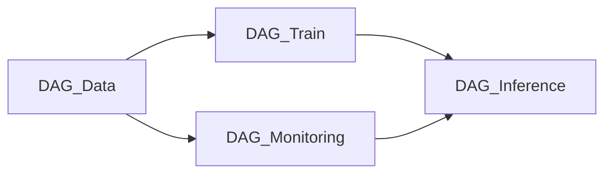

|DAG NAME|기능|
|:------|:-----|
|DAG_Data|D-1 기준, 최근 1년치 데이터를 SQLite DB에 적재, Train/Inference를 위한 데이터 전처리|
|DAG_Monitoring|D-1 기준, RMSE 모니터링을 통해 Best Model 갱신|
|DAG_Train|D-1 기준, 최근 N개월 데이터로 GRU 모델 학습|
|DAG_Inference|오늘날짜, 1시간 단위로 종가 예측|

# DAG Workflow

