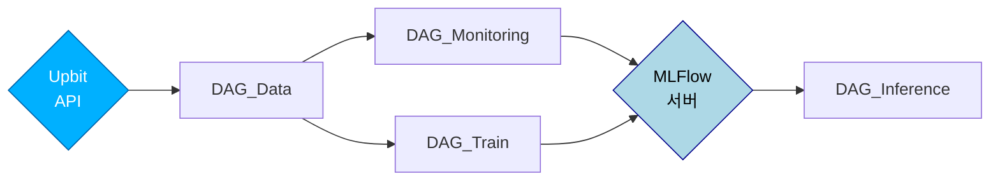

# "비트코인 종가 예측" Project
### 목적
- 업비트 거래소에서 제공되는 비트코인의 60분 캔들 정보(OHLCV: Open, High, Low, Close, Volume)를 기반으로, 미래의 종가를 예측하는 모델을 개발합니다.

### 가정
- 비트코인에 대한 정보는 **다음날 01:00:00 KST** 시간이 되어야 알 수 있습니다.
 

# DAG Workflow 

 

|DAG명|대상데이터 날짜| DAG 기능|
|------|---------|-----|
|DAG_Data | (D-1)일 |- 비트코인 60분 캔들의 최근 1년치 데이터를 SQLite DB에 적재   - Train/Inference를 위한 데이터 전처리 (데이터보간/스케일링/슬라이딩윈도우 적용)|
|DAG_Monitoring | (D-1)일 | - (D-3)일까지의 Best Model과 (D-2)일 학습 모델 비교   - 두 모델의 (D-1)일 inference 결과에 대한 RMSE 모니터링을 통해  MLFlow 서버의 best_model 갱신   ***실행첫날은 Monitoring 스킵**|
|DAG_Train | (D-1)일 | - 최근 N개월 데이터로 GRU 모델 학습   - MLFlow 서버에 recent_model로 저장|
|DAG_Inference |Today (*예측)| - Best Model, Train Model 각각 1시간 단위로 오늘날짜의 "종가" 예측  |
 

# 디렉토리 구조

| 디렉토리명                                                                                                               | 설명                         |
|--------------------------------------------------------------------------------------------------------------------------|------------------------------|
| airflow                                                                                                                  | 최상위 디렉토리              |
| &nbsp; ├── dag                                                                                                           | DAG 소스코드 디렉토리        |
| &nbsp; │&nbsp;&nbsp;&nbsp;&nbsp;&nbsp;&nbsp;&nbsp;└── outputs                                                            | DAG 실행결과 디렉토리            |
| &nbsp; │&nbsp;&nbsp;&nbsp;&nbsp;&nbsp;&nbsp;&nbsp;&nbsp;&nbsp;&nbsp;&nbsp;&nbsp;&nbsp;&nbsp;&nbsp;       ├── data        | SQLite DB, 전처리완료 데이터 디렉토리 |
| &nbsp; │&nbsp;&nbsp;&nbsp;&nbsp;&nbsp;&nbsp;&nbsp;&nbsp;&nbsp;&nbsp;&nbsp;&nbsp;&nbsp;&nbsp;&nbsp;       ├── inference   | Inference 디렉토리      |
| &nbsp; │&nbsp;&nbsp;&nbsp;&nbsp;&nbsp;&nbsp;&nbsp;&nbsp;&nbsp;&nbsp;&nbsp;&nbsp;&nbsp;&nbsp;&nbsp;       └── mlruns      | MLFlow 디렉토리        |
| &nbsp; │&nbsp;&nbsp;&nbsp;&nbsp;&nbsp;&nbsp;&nbsp;└── utils                                                              | 사용자 정의함수, config 디렉토리 |
| &nbsp; └── logs                                                                                                          | DAG 실행 결과 로그 디렉토리  |
